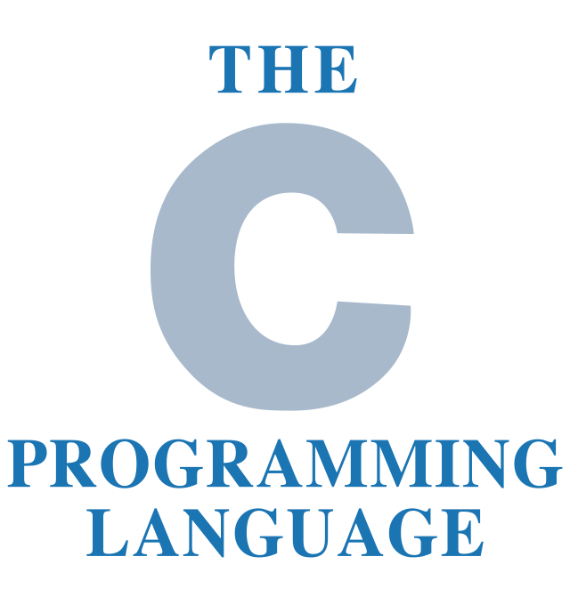

<div id="top"></div>
<!--
*** Thanks for checking out the Best-README-Template. If you have a suggestion
*** that would make this better, please fork the repo and create a pull request
*** or simply open an issue with the tag "enhancement".
*** Don't forget to give the project a star!
*** Thanks again! Now go create something AMAZING! :D
-->


<!-- PROJECT SHIELDS -->
<!--
*** I'm using markdown "reference style" links for readability.
*** Reference links are enclosed in brackets [ ] instead of parentheses ( ).
*** See the bottom of this document for the declaration of the reference variables
*** for contributors-url, forks-url, etc. This is an optional, concise syntax you may use.
*** https://www.markdownguide.org/basic-syntax/#reference-style-links
-->


<!--

*** GENERA UNOS CUADRITOS ARRIBA COMO LOS DEL BADGE

[![Contributors][contributors-shield]][contributors-url]
[![Forks][forks-shield]][forks-url]
[![Stargazers][stars-shield]][stars-url]
[![Issues][issues-shield]][issues-url]
[![MIT License][license-shield]][license-url]
[![LinkedIn][linkedin-shield]][linkedin-url]
-->


<!-- ENCABEZADO -->
<br />
<div align="center">
  <a href="https://github.com/MatFernandez/C"> 
    
  </a>

<h3 align="center">CURSO C</h3>

  <p align="center">
    Este repositorio guarda lo visto en el curso de C
    <br />
    <a href="https://github.com/MatFernandez/C"><strong> Vista previa del repositorio»</strong></a>
    <br />
    <br />
    <a href="https://github.com/MatFernandez/C/issues">Reportar un bug</a>
    ·
    <a href="https://github.com/MatFernandez/C/pulls">Solicita un cambio en el proyecto</a>
  </p>
</div>


<!-- CONTENIDO DEL REPOSITORIO -->
<details>
  <summary>Tabla de contenido</summary>
  <ol>
    <li>
      <a href="#Sobre-el-proyecto">Sobre el proyecto</a>
      <ul>
        <li><a href="#Herramientas-utilizadas">Herramientas utilizadas</a></li>
      </ul>
    </li>
    <li>
      <a href="#Comenzando">Comenzando</a>
      <ul>
        <li><a href="#Prerequisitos">Prerequisitos</a></li>
        <li><a href="#Instalacion-del-repositorio">Instalacion del repositorio</a></li>
      </ul>
    </li>
    <li><a href="#Usos-del-proyecto">Usos del proyecto</a></li>
    <li><a href="#Nuevas-incorporaciones-al-proyecto">Nuevas incorporaciones al proyecto</a></li>
    <li><a href="#Contribuciones">Contribuciones</a></li>
    <li><a href="#Licencia">Licencia</a></li>
    <li><a href="#Contacto">Contacto</a></li>
    <li><a href="#Agradecimientos">Agradecimientos</a></li>
  </ol>
</details>


<!-- ABOUT THE PROJECT (ES PARA CUANDO YA LA PAGINA YA TIENE UN DOMINIO Y SE PUEDE MOSTRAR)
## Sobre el proyecto

[![Product Name Screen Shot][product-screenshot]](https://example.com)

Here's a blank template to get started: To avoid retyping too much info. Do a search and replace with your text editor for the following: `github_username`, `repo_name`, `twitter_handle`, `linkedin_username`, `email`, `email_client`, `project_title`, `project_description`

<p align="right">(<a href="#top">Volver al principio</a>)</p>
-->


## Sobre el proyecto

<div> 
  <p align = "justify"> El siguiente proyecto fue creado con el fin de aprender las bases y funcionalidades del lenguaje HTML5 como inicio en el desarrollo web. 
El mismo podria definirse como una "plantilla" donde se encuentran (en su mayoria) todas las utilidades que provee el lenguaje para estructurar paginas web.
Es importante recordar que HTML5 solo permite "estructurar" una pagina web, y NO le dara diseño o prolijidad. Para lograr lo antes dicho, se debe complementar
el aprendizaje de este lenguaje con otros, como CSS y Javascript. De esta forma, el desarrollador tendrá los conocimientos necesarios para abordar el desarrollo web. </p>
  </div>
    
    
### Herramientas utilizadas

* [HTML5](https://lenguajehtml.com)


<p align="right">(<a href="#top">Volver al principio</a>)</p>


<!-- GETTING STARTED -->
## Comenzando 

A continuacion se detalla como utilizar el proyecto. Teniendo en cuenta que solo fue utilizado HTML5, los requisitos e instalacion es muy simple.

### Prerequisitos

Como se dijo anteriormente, los requisitos son muy escasos. Se debe contar con:

* Navegador compatible con HTML5 (Google Chrome, Mozilla Firefox, Opera Web Browser, entre otros).

### Instalacion del repositorio

1. Clonar el repositorio
   ```sh
   git clone https://github.com/MatFernandez/HTML5.git
   ```
2. Ubicar el archivo indice
   ```sh
   index.html
   ```
3. Abrir dicho archivo en un navegador compatible con HTML5 (por ejemplo, los descriptos anteriormente)


<p align="right">(<a href="#top">Volver al principio</a>)</p>


<!-- USAGE EXAMPLES -->
## Usos del proyecto

Como se dijo previamente, este repositorio sirve a modo de ejemplo y aprendizaje del lenguaje HTML5. Al final de dicho indice, se encuentra una seccion con algunas anotaciones
y explicaciones a tener en cuenta aprendidas durante el curso. A continuacion se detallan algunos links utiles a modo de complemento y consula:

_Links utiles:_ 

* _[LenguajeHTML](https://lenguajehtml.com/html/)_
* _[DeveloperMozilla](https://developer.mozilla.org/es/docs/Web/HTML)_
* _[DesarrolloWeb](https://desarrolloweb.com/home/html)_


<p align="right">(<a href="#top">Volver al principio</a>)</p>


<!-- ROADMAP -->
## Nuevas incorporaciones al proyecto

- [ ] Agregar un poco mas de teoria en la ultima seccion
- [ ] Complementar con otras etiquetas (menos usadas) en el codigo

Podes visitar tambien [Issues](https://github.com/MatFernandez/HTML5/issues) para ver todas las propuestas.

<p align="right">(<a href="#top">Volver al principio</a>)</p>


<!-- CONTRIBUTING -->
## Contribuciones

Para cualquier sugerencia que pueda mejorar el proyecto, no dudes en hacerle un fork al repo y crear en un pull request.
Para cualquier consulta, mas abajo se encuentra la informacion de contacto. Gracias!

1. Hacer un fork del proyecto.
2. Crear una nueva branch (`git checkout -b complemento/NuevosAgregados`).
3. Hace un commit de los cambios (`git commit -m 'Complemento con algunas cosas'`).
4. Pushea a la branch (`git push origin complemento/NuevosAgregados`).
5. Finalmente, abri un pull request.

<p align="right">(<a href="#top">Volver al principio</a>)</p>


<!-- LICENSE -->
## Licencia

No hay licencia en este repositorio. Si la hubiese, consultar el archivo LICENSE.txt

<p align="right">(<a href="#top">Volver al principio</a>)</p>


<!-- CONTACT -->
## Contacto

Matias Agustin Fernandez - [@MatFernandez](https://github.com/MatFernandez) - mattifernan19@gmail.com

Link del proyecto: [https://github.com/MatFernandez/HTML5](https://github.com/MatFernandez/HTML5)

<p align="right">(<a href="#top">Volver al principio</a>)</p>


<!-- ACKNOWLEDGMENTS -->
## Agradecimientos

* [SoyDalto](https://www.youtube.com/c/soydalto)
* [HolaMundo](https://www.youtube.com/c/HolaMundoDev)


<p align="right">(<a href="#top">Volver al principio</a>)</p>


<!-- MARKDOWN LINKS & IMAGES -->
<!-- https://www.markdownguide.org/basic-syntax/#reference-style-links -->

<!--

PARA LOS BADGE (del principio del Readme, comentado mas arriba) , INVESTIGAR MAS DE https://img.shields.io EN ALGUN MOMENTO. 
 
[contributors-shield]: https://img.shields.io/github/contributors/github_username/repo_name.svg?style=for-the-badge
[contributors-url]: https://github.com/github_username/repo_name/graphs/contributors
[forks-shield]: https://img.shields.io/github/forks/github_username/repo_name.svg?style=for-the-badge
[forks-url]: https://github.com/github_username/repo_name/network/members
[stars-shield]: https://img.shields.io/github/stars/github_username/repo_name.svg?style=for-the-badge
[stars-url]: https://github.com/github_username/repo_name/stargazers
[issues-shield]: https://img.shields.io/github/issues/github_username/repo_name.svg?style=for-the-badge
[issues-url]: https://github.com/github_username/repo_name/issues
[license-shield]: https://img.shields.io/github/license/github_username/repo_name.svg?style=for-the-badge
[license-url]: https://github.com/github_username/repo_name/blob/master/LICENSE.txt
[linkedin-shield]: https://img.shields.io/badge/-LinkedIn-black.svg?style=for-the-badge&logo=linkedin&colorB=555
[linkedin-url]: https://linkedin.com/in/linkedin_username
[product-screenshot]: images/screenshot.png
-->
